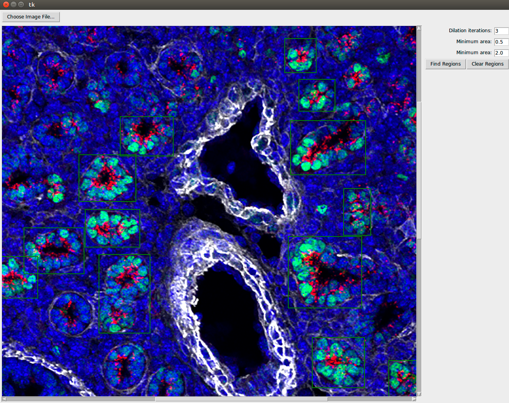
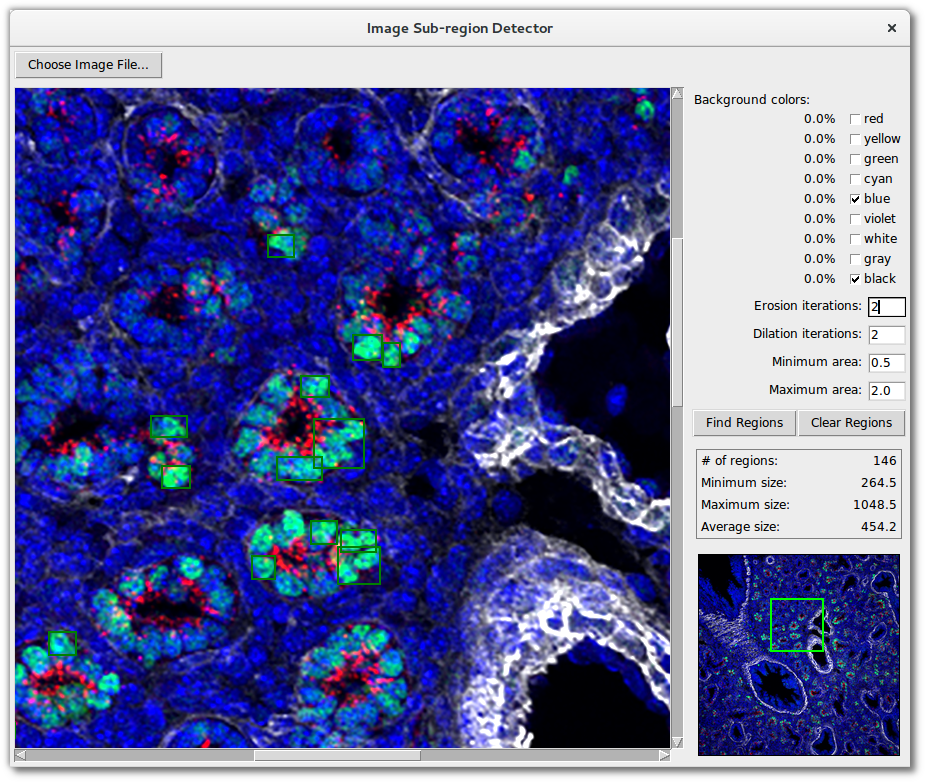

# Progress Log

## Week 1

- Created [image-subregion-extractor](https://github.com/whitews/image-subregion-extractor) for quickly saving sub-regions from images to create training and test sets [Scott]
- Start TensorFlow image detection pipeline [Ben]
- Blob detection using differential operators [Lina]
- Kingshuk came as guest - made following suggestions
    - Use full use of biological knowledge including 3D if available
    - Watershed is difficult to make work well in his experience

### Group meeting actions

- Use systematic approach to pipeline stage evaluation [Lina]
- To prepare tutorial on TensorFlow (Ben)
- Evaluate classification pipeline (Scott)

## Week 2

- Update on marker spreadsheet by Susan
- Revisions to blob detection pipeline [Lina]
- Cascade classifier performs very poorly (Scott)
- Created [image-subregion-detector](https://github.com/whitews/image-subregion-detector) for real-time image segmentation (Scott)

- Created mapping of symbolic color names to HSV space (Scott)
- Presented TensorFlow demo (Ben)

### Group meeting actions

- Develop list of segmentation targets and characteristics [Lina]
- Manual feature selection/reduction for classification of acinar tubules [Lina]
- Implement [digit recognition from Google Street View](https://www.udacity.com/course/deep-learning--ud730) pipeline for TensorFlow (Ben)
- Add features to image-subregion-detector (Scott)
    - API for region detection pipeline plugins
    - Accept/Reject detected image regions
    - Consider how to integrate image metadata to improve region detection
    - Consider selection of positive and negative regions to Start
    - Consider iterative improvement of detected regions (reinforcement learning)

## Week 3

- Updates to [image-subregion-detector](https://github.com/whitews/image-subregion-detector) (Scott)
    - Expanded definition for 'black' HSV color range
    - Added functionality to specify (multiple) background color ranges
    - Remove detected sub-regions by right-clicking on them
    - BUGFIXES: properly clear user-drawn rects, support 16-bit RGB TIFs (by downsampling to 8-bit)
- Explored segmentation targets (cells and anatomical structures as below) and their characteristics (Lina)
  (brief descriptions are in this [pdf](https://github.com/duke-lungmap-team/lungmap-scratch/tree/master/Lina/Segmentation_targets.pdf) )
    - Pericytes
    - Club cells
    - Ciliated cells
    - Bronchioles
    - Acinar tubules (some thoughts on acinar tubule criteria)
- Continuing research into the use of machine learning algorithms implemented via TensorFlow (Ben)
    - If we were to build a training set (Scott's tool), we'd have about one-tenth the amount of usual machine learning training data
    - Currnetly, implementing the digit recognition algorithm with low sample counts to simulate our situation to get a feel for "deterioration" of accurarcy with low training sets
    - Spiking on the following machine learning techniques in TensorFlow:
        - Covnets
        - Regularization
        - Dropout
        - ReLUs (Rectified Linear Units)

## Week 4

- More updates to [image-subregion-detector](https://github.com/whitews/image-subregion-detector) (Scott)
    - [Sub-region detector presentation](./scott/Sub-region Detector Algo Summary.pdf)
    - Added interactive preview image for easier navigation around the main canvas
    - Added some stats about the detected regions (count, min/max/avg size)
    - Display color range % for user drawn rectangle (helps choose appropriate bg colors)
    - Better region detection for single cells (via new pre-erosion option)
    - BUGFIXES:
        - Clear sub-regions when selecting a new image
        - Fix typo in maximum area label
        - Fix error thrown if zero regions are detected
    - New screenshot:
    
- Built two neural network algorithms (TensorFlow) to examine impact of sample size on accuracy (Ben)
    - Files for replication can be found in [./queries](./queries/README.md)
    - **Results**
        - Multinomial Logistic Classifier (Gradient Descent) - [visually seems to indicate > 4,000 training images](./queries/viable_sample_size/logistic_classifier2.png)
        - Multinomial Logistic Classifier (Stochastic Gradient Descent) - [visually seems to indicate 4,000 training images](./queries/viable_sample_size/mlc_sgd.png)
    - Where to go from here?
        - Continue for at least one more week to see if there are techniques for dealing with small sample sizes, such as:
        1. Try to make the network "deeper" - add several more nodes including Rectified Linear Units (ReLUs) and Regularization
        2. Stocastic Gradient Descent, can be thought of as a type of bootstrap, would like to play around with this idea a bit more
        3. Explore the idea of building a (supervised probabilistic classifier via Gaussian Copulas)[http://www.cimat.mx/~mrivera/bookchapt/salinas_copulas_lncs10.pdf]
- Literature reading, summarized potential useful features that may facilitate structure classification, and identified blood vessels(Lina)
    - [features](https://github.com/duke-lungmap-team/lungmap-scratch/tree/master/Lina/Commonly used features for analyzing Histology Images.pdf)
        - Color
        - Texture
        - Morphology
        - Architecture
    - Identified [Blood vessels in 6 images](https://github.com/duke-lungmap-team/lungmap-scratch/tree/master/Lina/blood_vessels.pdf)

## Summary for August 2016

### Software
- Set up an open source [Github repository](https://github.com/duke-lungmap-team/lungmap-scratch) to share code and documents among group
- Built [image-subregion-extrractor](https://github.com/whitews/image-subregion-extractor) tool for rapid construction of training sets
- Built [image-subregion-detector](https://github.com/whitews/image-subregion-detector) as GUI for evaluating image segmentation pipelines.

### Algorithms
- Investigation of Google's TensorFlow library for image classification using deep learning. Initial impression is that TensorFlow applications may require a larger training set than we have in order to give accurate classification, but this is still being [looked into](./queries/README.md).
- [Rapid two-stage image segmentation pipeline](./scott/Sub-region Detector Algo Summary.pdf) based on blob detection by immunofluorescent color foreground/background partitioning and blob classification by size constraints developed as prototype engine for image-subregion-detector.
- [Review of literature](https://github.com/duke-lungmap-team/lungmap-scratch/tree/master/Lina/Commonly used features for analyzing Histology Images.pdf) for statistical features (color, texture, morphology and architecture) useful for classifying histology images

### Knowledge Base
- Review of [characteristic features](https://github.com/duke-lungmap-team/lungmap-scratch/tree/master/Lina/Segmentation_targets.pdf)) of anatomical structures and cells in the developing lung

## Summary for September 2016

### Software
- Added ability of  [image-subregion-extrractor](https://github.com/whitews/image-subregion-extractor) to capture bit masks as numpy arrays
- Built application to evaluate object recognition algorithms as plug-ins (successful demo using Haar cascade classifier plug-in for real-time face recognition)
- Script to run TensorBox training and evaluation completed - worked out issues with specifying training sets and evaluated on test data
- Script to extract bounding boxes for extracted images in training set in format required for TensorBox

### Algorithms
- Use of [TensorBox](https://github.com/Russell91/TensorBox) for object detection and segmentation

## Running objectives

1. Heuristic algorithm to extract sub-images for training set (stage 1: create blobs from feature colors, stage 2: filter for blobs that are similar to exemplar)
  - [x] Graphical user interface
  - [x] Object recognition using single exemplar
  - [x] Export images to numpy arrays as training sets
  - [ ] Create JSON file with bounding boxes for target locations
  - [ ] Object recognition using multiple exemplars
2. Build positive and negative training sets for anatomical objects
  - [ ] Tubules
  - [ ] Terminal bronchioles
  - [ ] Blood vessels
  - [ ] Type II epithelial cells
3. Evaluate summary image features for classification
  - [ ] Define list of features for evaluation on training sets
  - [ ] Evaluate performance of individual features for classification accuracy
  - [ ] Evaluate performance of combined features for classification accuracy
  - [ ] Integrate features found into stage 2 of image extractor
4. Evaluate deep learning for in-image object recognition and segmentation
  - [x] Evaluate how TensorFlow library works
  - [x] Graphical user interface to plug-in algorithms
  - [x] Train and test on standard data sets
  - [ ] Train and test on LungMAP IHC positive and negative training sets
5. Construct a formal knowledge base of interesting anatomical structures and cells and their statistical features in the developing mouse lung (with Anna Maria)
  - [ ] Create a table with rows containing (name, stage, feature, measurement, statistic, value) e.g. (proximal tubule, E16.5, SOCS-9, area, min, 20 $\mu$m)
  - [ ] Use of knowledge base to provide sensible default parameters (e.g. # erosions) for known targets so as to increase sensitivity of blob detection (stage 1)
  - [ ] Use of knowledge base to create filters based on feature statistics so as to increase specificity of blob classification (stage 2)
6. Explore patterns with statistical analysis of discovered image segments (with Kingshuk)
  - [ ] Cross-sectional analysis of counts and distributions
  - [ ] Longitudinal analysis of counts and distributions
