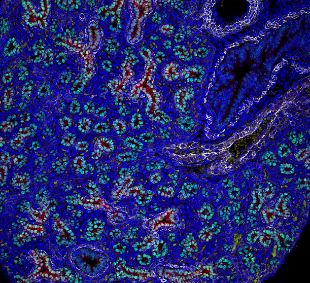
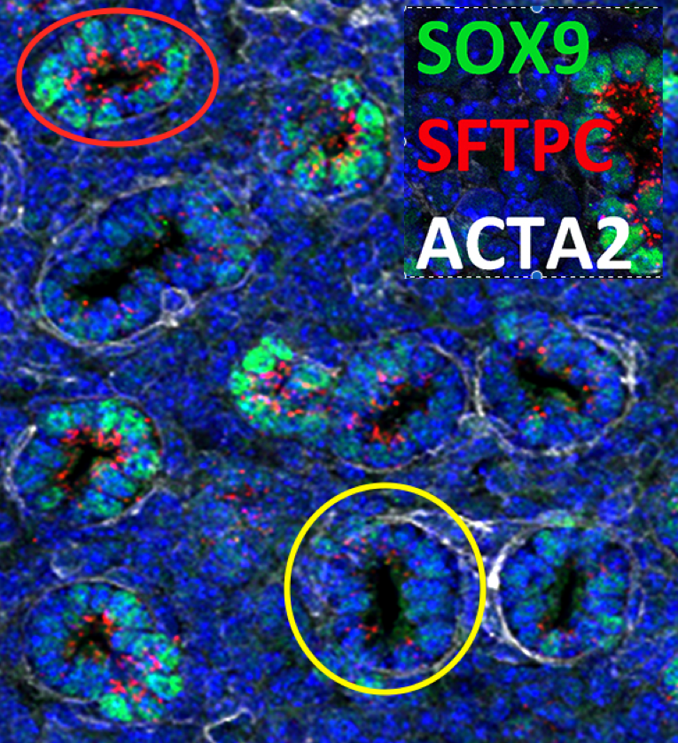

## General

- When will additional images be uploaded to LungMAP and how many additional images are expected over the next 9 months?

Nathan will check if there are additional images not uploaded by the collaborating site to LungMAP. He thinks they may have selected just the best images to upload.

- Do we know what a sample is and what an experiment is?

An experiment is performed for some objective, and typically is for a unique set of probes. An experiment may involve multiple animals. A sample is refers to a particular tissue from one animal.

- Why are there multiple 20x images for the same experiment?

Multiple images typically represent different slices from the same tissue and one animal, usually to expose possible variation across locations. It is also possible to have samples from different animals in the same experiment.

- Are these different slices on z plane or some other location

Not for immunofluorescent images in the LungMAP database.

- Are there any more annotated images available?

Not at present, but they expect to get more in the near future.

## Specific

- What do the various probes represent?

Please see the attached [PDF](data/markers01.pdf) or [spreadsheet](data/markers01.xlsx) for cell specific marker information.

- How to distinguish distal and poximal acinar tubules in samples that are not stained with SOX9 and SFTPC?
  For example, this slide is stained with HOPX, NKX2.1 and ACTA2, could you let us know the criteria for distinguishing proximal and distal acinar tubules?

I don't think it is possible - in such cases, just being able to identify them as acinar tubules will suffice.

- Do you know if the structures circled in RED and YELLOW are to be considered the same anatomical structure or different?

Hi, Cliburn.  They are not exactly the same, but rather distal and proximal regions of the same structure – the acinar tubule.

The distal acinar tubules will become alveoli and the proximal acinar tubule will become alveolar ducts. They are different from the terminal and lateral bronchioles (distal conducitng airways).  And have (or will have) different subpopulations of cell types.  The epithelial cells of the acinar tubules will become type 1 and type 2 cells; while the cells of the bronchioles will become club cells, ciliated cells, and neuroendocrine cells.

Here is the key:

Red circles and arrows indicate the distal acinar tubules /acinar buds.
SOX9 (green nuclei) is a marker for the distal acinar tubules. (SOX2 marks the proximal airway – not shown).
ACTA2 staining (white) is normally not  found (or very weak) around the distal tubules.

Yellow circles and arrows indicate the proximal acinar tubules, which lack or have low levels of SOX9 .
These tend to be larger in diameter & have a single layer of smooth muscle cells (ACTA2/white)
adjacent to the epithelium.  

SFTPC (red, punctate, apical, cytoplasmic staining) is found in both proximal
& distal tubules, but its expression is greater in the distal tubules than in the proximal tubules.

Note expression gradients for SFTPC – increasing from proximal to distal;
for SOX9 – increasing from proximal to distal; and for ACTA2 – decreasing from proximal to distal.

Staining is not all of nothing.  There are transition zones/gradients for all 3 immunostains.

These tubules are all continuous starting with the lateral bronchiole —> terminal bronchiole —>
proximal acinar tubule —> distal acinar tubule.   There is no staining for SOX9 or SFTPC in
the lateral or terminal bronchioles.

See attached PowerPoint [PDF](data/susan.pdf) or [slides](data/susan.pptx).

Susan
